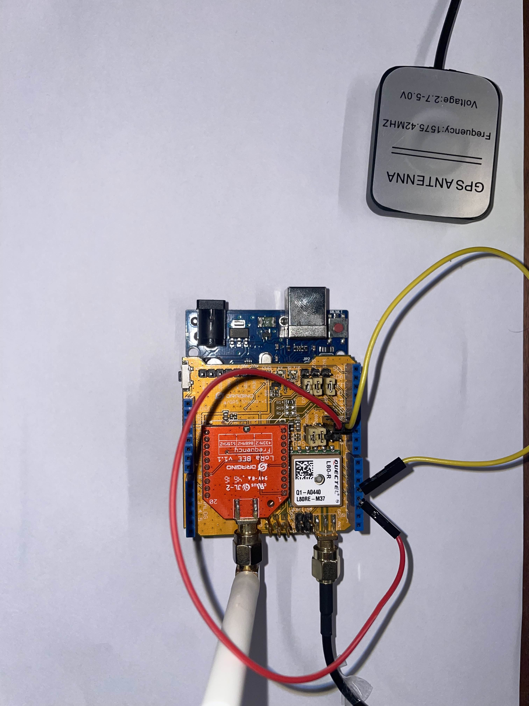

<h1>AutoSense Analytics</h1>
<em>A data collection company, utilizing Vehicle Mounted Sensors</em>  
Project developed by: Eleni Sakellariou-Matsi and Georgios Stergiopoulos for the "Internet of Things" course of the University of Patras.
<h2><a href="https://www.youtube.com/watch?v=UyGT7zMF970&feature=youtu.be">Demo Video</a></h2>
<h2><a href="/presentations/final/AutoSense_Analytics_Final.pdf">Final Presentation</a></h2>

Designed and developed a fully IoT system. The end-to-end architecture is displayed bellow:   

<h4><b>H/W and Sensors:</b></h4>
<ul>
<li>RaspberryPi: 4B 8GB RAM</li>
<li>RPi 4G HAT: SIM7600X</li>
<li>IMU: MPU6050</li>
<li>RPi HAT</li>
<li>Adruino with Dragino LoRa</li>
</ul>

<h4><b>S/W and Tools:</b></h4>
<ul>
<li>Web Dev: NodeJS, Handlebars, CSS, JS, HTML, expressJS</li>
<li>Databases: MySQL, SQLite, InfluxDB</li>
<li>Dashboards: Grafana</li>
<li>Others: REST-APIs, FIWARE, MQTT, Docker</li>
</ul>

<h4><b>Instructions (No Docker): </b></h4>
<h5>Website: </h5>
<ol>
  <li>Download the <code>website</code> folder (NodeJS must be installed)</li>
  <li>Navigate to the dir you downoladed</li>
  <li>Run <code>npm install</code> and then <code>node app.mjs</code></li>
  <li>Now you can visit the website at <a href="http://localhost:3000/">"http://localhost:3000/"</a></li>
  <li>Use:<ul><li><code>Username:</code> AutoSense</li><li><code>Password:</code> autoadmin</li></ul></li>
</ol>
<h5>Live Demo: </h5>
<ol>
  <li>Make sure the website is up and running</li>
  <li>Download the /backend_controller/demo_real_data_approach (Python must be installed)</li>
  <li>Navigate to the dir you downoladed</li>
  <li>Run <code>python (or python3) dev.py</code></li>
  <li>Now you can visit the website and watch the Live Demo at <a href="http://localhost:3000/admin/live">"http://localhost:3000/admin/live"</a></li>
</ol>

<h4><b>Instructions (Docker must be setup on your machine): </b></h4>
<ol>
  <li>Download the <code>DOCKER_FILES</code> folder</li>
  <li>Download and add the <code>website</code> folder inside the <code>DOCKER_FILES</code></li>
  <li>Navigate to the folder and execute command <code>docker-compose up --build</code></li>
</ol>
